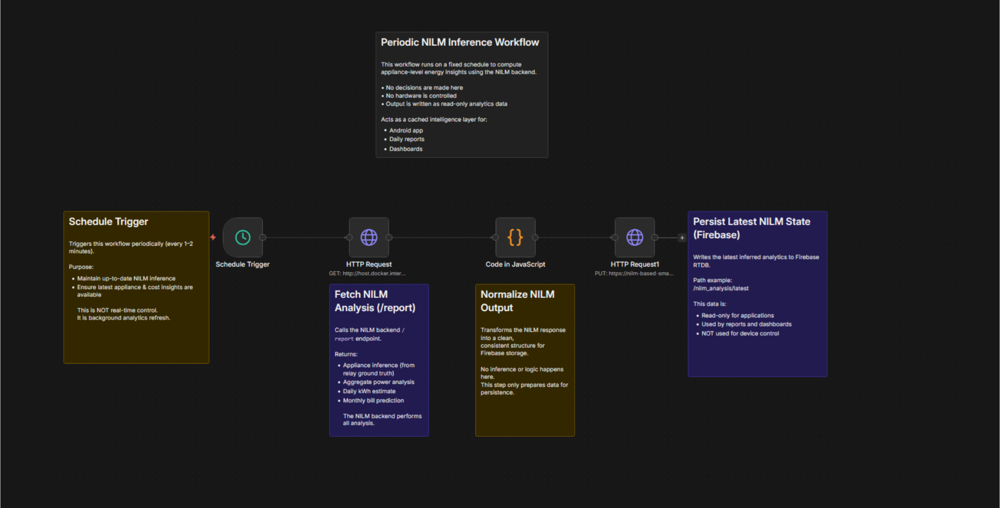
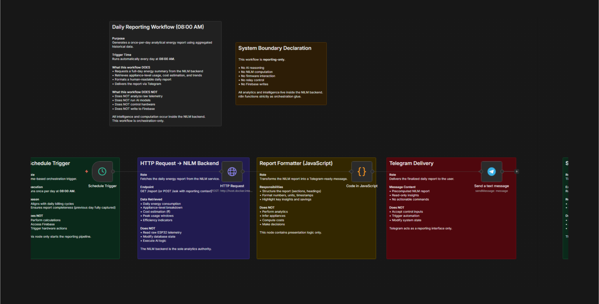
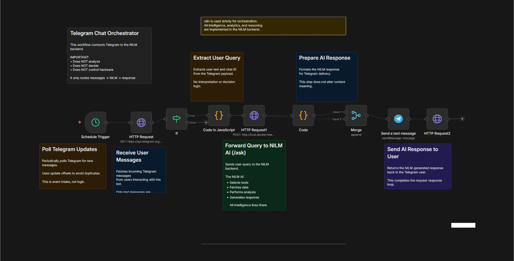

# ⚙️ SmartGrid n8n Automation Layer

## Orchestration & Workflow Control

This repository contains n8n workflows used in the SmartGrid / Nanometer ecosystem to orchestrate data flow between Firebase, the NILM backend, and Telegram.

### ⚠️ Important:
n8n performs orchestration only.  
It does not analyze data, infer appliances, or control hardware.

## Repository Scope

This repository implements the automation / orchestration layer of the SmartGrid system.

### Responsibilities:

- Scheduling periodic analytics jobs
- Routing data between services
- Triggering report generation
- Acting as a glue layer between Telegram and the NILM backend

### Out of scope:

- NILM inference logic
- AI reasoning
- Device control
- Firmware execution

All intelligence resides in the NILM backend.

## System Positioning
```
ESP32 Firmware
   ↓ (telemetry)
Firebase RTDB
   ↓ (reads)
NILM Backend (FastAPI + Gemini)
   ↓ (HTTP API)
n8n Automation (THIS REPO)
   ↓
Telegram / Firebase / Android App
```

n8n is used only where deterministic scheduling and routing are required.

## Repository Structure
```
smartgrid-n8n-automation/
├── n8n/
│   ├── workflows/
│   │   ├── Periodic NILM Inference.json
│   │   ├── Daily Energy Report.json
│   │   └── Telegram Chat Orchestrator.json
│   │
│   ├── screenshots/
│   │   ├── periodic-nilm-inference.svg
│   │   ├── daily-energy-report.svg
│   │   └── telegram-chat-orchestrator.svg
│   │
│   └── (workflows and screenshots)
│
└── README.md
```

## Workflow Overview

### 1️⃣ Periodic NILM Inference

**Purpose:** Background analytics refresh

**What it does**
- Runs on a fixed schedule (every few minutes)
- Calls NILM /report
- Stores the latest inferred analytics back to Firebase

**What it does NOT do**
- No hardware control
- No AI reasoning
- No user interaction

**Why it exists**
- Keeps appliance-level insights cached
- Avoids recomputation on every user request

**Data Flow**
```
Schedule → NILM /report → Normalize → Firebase (read-only analytics)
```



### 2️⃣ Daily Energy Report (8 AM / 8 PM)

**Purpose:** Human-readable energy summary

**What it does**
- Runs once per day
- Reads historical energy data
- Sends a structured query to NILM /ask
- Delivers a summarized report via Telegram

**What it does NOT do**
- No calculations inside n8n
- No billing logic
- No appliance inference

**Why it exists**
- Separates data collection from human communication
- Keeps reporting reproducible and auditable

**Data Flow**
```
Schedule → Firebase Read → NILM /ask → Format → Telegram
```



### 3️⃣ Telegram Chat Orchestrator

**Purpose:** Conversational routing layer

**What it does**
- Polls Telegram for user messages
- Forwards text queries to NILM /ask
- Returns AI-generated responses

**What it does NOT do**
- No interpretation
- No tool selection
- No logic branching

**Critical Design Rule**  
```
Telegram → NILM → Telegram
```

n8n never "thinks".  
It only passes messages.



## Design Principles

### 🔒 Separation of Concerns
- Firmware → deterministic execution
- NILM backend → analytics & AI reasoning
- n8n → orchestration only

### 🧠 No Hidden Intelligence
- No AI nodes inside n8n
- No business logic in JavaScript nodes
- All reasoning is centralized and auditable

### 🧪 Reproducibility
- Every workflow is exportable as JSON
- Every execution can be replayed
- No side effects outside defined endpoints

## Why n8n (and not custom code)?

n8n is used because:

- Scheduling is explicit and inspectable
- Failures are visible and logged
- Workflow graphs document system behavior
- No hidden background threads or cron jobs

This improves academic clarity and system traceability.

## Security & Safety Notes

- n8n has no write access to relay control paths
- Hardware control remains firmware-only
- Firebase writes are limited to analytics namespaces
- Telegram workflows cannot trigger device actions

## Relationship to Other Repositories
| Repository | Role |
|------------|------|
| esp32-smart-energy-meter | Firmware & sensing |
| NILM | Analytics & AI backend |
| nanometer | Android application |
| smartgrid-n8n-automation | Orchestration layer |

## Project Status

✅ Completed and submitted  
This repository represents the final submitted state of the automation layer for the SmartGrid / Nanometer final-year engineering project (2025–2026).

No further functional changes are planned.

## Author

Aman  
Final-year Electrical Engineering student  
Focus: embedded systems, cloud analytics, system orchestration

GitHub: https://github.com/Itsamnn